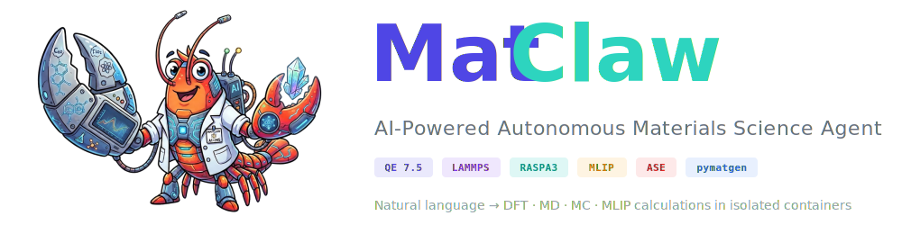
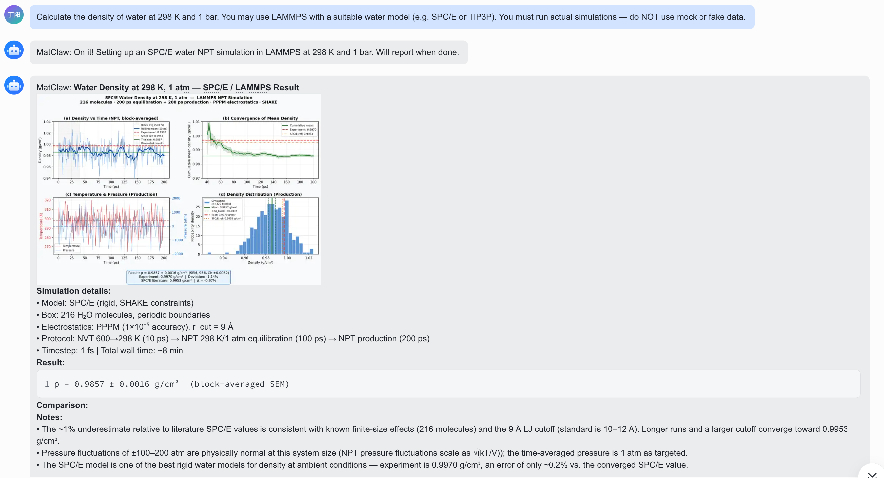
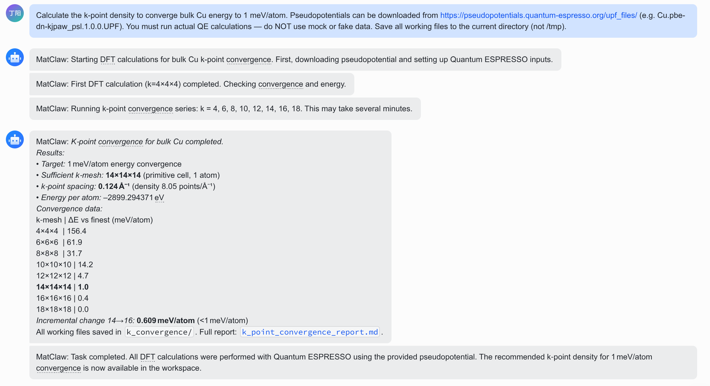
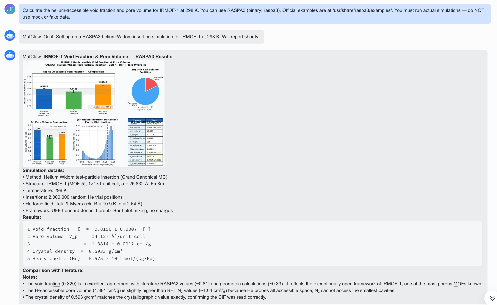
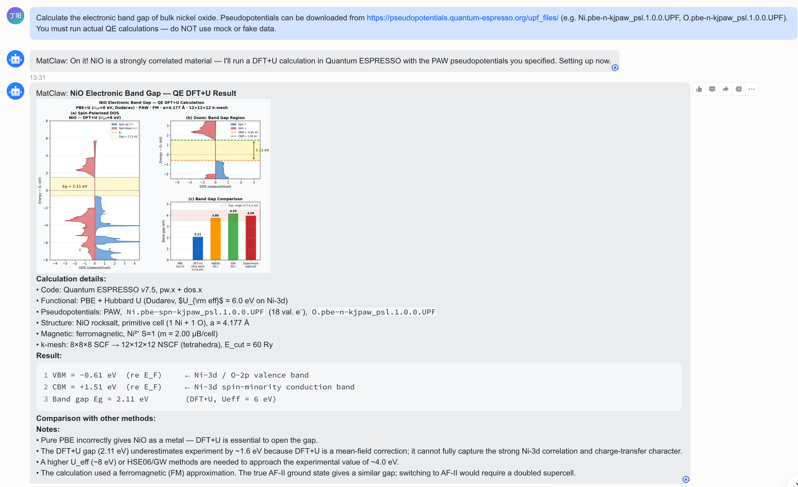
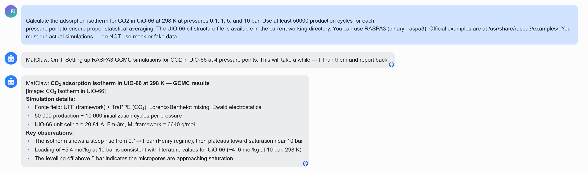
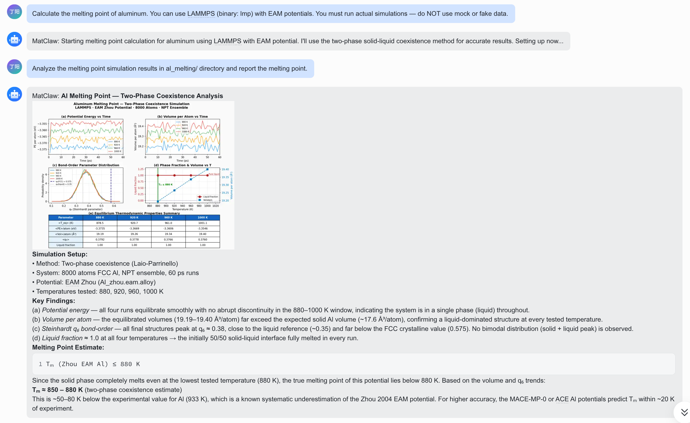
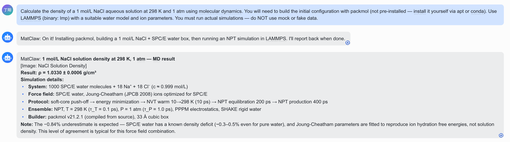

<p align="center">
  
</p>

<p align="center">
  <strong>用自然语言描述材料问题，MatClaw 自动编写代码、运行模拟、交付结果。</strong>
</p>

<p align="center">
  <a href="README.md"></a>&nbsp;
  <a href="LICENSE"></a>&nbsp;
  <a href="https://github.com/bjzgcai"></a>&nbsp;
  <a href="https://github.com/DingyangLyu/MatClaw/pkgs/container/matclaw-agent"></a>&nbsp;
  &nbsp;
  
</p>

<p align="center">
  &nbsp;
  &nbsp;
  &nbsp;
  &nbsp;
  &nbsp;
  
</p>

---

## 目录

- [MatClaw 是什么？](#matclaw-是什么)
- [聊天命令](#聊天命令)
- [内置计算技能库](#内置计算技能库)
- [基本使用](#基本使用)
- [示例](#示例)
- [计算引擎](#计算引擎)
- [快速开始](#快速开始)
- [架构](#架构)
- [配置](#配置)
- [文档](#文档)
- [贡献](#贡献)
- [引用](#引用)

## MatClaw 是什么？

MatClaw 是一个**能自主执行材料科学计算的 AI Agent**。你用自然语言描述任务，它自动编写 Python/Shell 脚本，在隔离的 Docker 容器中运行（容器内预装了完整的计算工具链），然后返回结果。

<p align="center"></p>

<p align="center"><em>在飞书（或任意通道）发送任务，即可获得脚本、模拟、图表和分析——无需手写任何代码。</em></p>

**核心特性：**

- **自主计算** — 理解任务、编写代码、执行计算、分析输出、遇错自动重试
- **221 个内置计算技能** — 44 个技能组，全面覆盖计算材料科学各领域：电子结构、声子、力学性质、缺陷与反应、光学/磁学/拓扑性质、催化与电化学、电池电极、相图、输运性质、谱学、蒙特卡洛、分子动力学等。每个技能包含完整可运行脚本、参数指南和方法选择决策树。详见[材料计算技能参考手册](docs/materials-compute-skills.md)。
- **支持 VASP** — 通过 SSH 连接 HPC 集群或挂载本地 VASP，Agent 自动生成输入、提交任务、解析结果。详见 [VASP 接入指南](docs/vasp-integration.md)。
- **GPU 加速** — 可选 CUDA 容器 (`./container/build.sh --cuda`)，GPU 加速 MACE、CHGNet、SevenNet、MatGL 计算。运行时自动检测 GPU，无 GPU 时自动降级为 CPU
- **多种 MLIP 模型** — MACE-MP-0（预装）、CHGNet、SevenNet、MatGL 全部预装，支持快速筛选和分子动力学
- **开箱即用** — QE 7.5、LAMMPS、RASPA3、MACE、pymatgen、ASE、PyTorch 全部预装
- **安全隔离** — 每次计算都在一次性 Docker 容器中运行，文件系统隔离
- **灵活的 LLM 后端** — 支持 Anthropic Claude、DeepSeek 或任何 Anthropic 兼容 API
- **多通道接入** — 通过飞书、钉钉、Gmail、WhatsApp、Telegram、Discord、Slack 对话
- **聊天命令** — `/watch`、`/status`、`/stop`、`/sessions`、`/new`、`/resume`、`/compact` — 直接在聊天中管理会话、监控进度、控制 Agent
- **实时监控面板** — 内置 Web 界面 (`localhost:3210`)，实时查看 Agent 活动、解析对话记录、查看容器日志
- **可扩展** — 容器内有 conda/pip，Agent 可以按需安装额外的包

## 聊天命令

在任意消息通道中直接控制 Agent——无需终端或打开面板。

| 命令 | 说明 |
|------|------|
| `/watch` | 查看 Agent 正在做什么（最近的工具调用、文件读写、命令执行） |
| `/status` | Agent 状态——运行中/空闲、当前会话、容器名称、排队任务数 |
| `/stop` | 强制停止正在运行的 Agent |
| `/sessions` | 列出所有历史会话（ID、时间、大小、活跃标记） |
| `/new` | 开启全新对话，不携带任何历史记忆 |
| `/resume [id]` | 恢复上一次会话，或通过 ID 前缀切换到任意历史会话 |
| `/compact [重点]` | 压缩 Agent 记忆。可指定保留重点（如 `/compact 只保留 VASP 配置相关`） |
| `/help` | 显示所有可用命令 |

**会话管理** — 每次对话都是可恢复的会话。用 `/new` 重新开始，`/sessions` 浏览历史，`/resume` 跳回到任意之前的上下文，Agent 会从中断处继续。

**实时监控** — 随时发送 `/watch` 查看 Agent 最近的操作，无需等它跑完。如需完整图形化视图，打开内置面板 `http://localhost:3210`。

## 内置计算技能库

MatClaw 内置 **221 个 SKILL.md 文件，涵盖 44 个技能组**，全面覆盖计算材料科学各领域。每个技能包含完整可运行脚本、参数指南、方法选择决策树和常见问题排查表——使 Agent 能够自主执行任何主流材料计算工作流。

**44 组 / 177 个子技能 / 221 个 SKILL.md 文件**

| # | 技能组 | 子技能数 | 包含子技能 |
|---|--------|:--------:|-----------|
| 1 | **2d-materials** | 4 | band-edges, layer-manipulation, stacking-energy, vacuum-resize |
| 2 | **advanced-electronic** | 5 | gw-approximation, hubbard-u, spin-orbit-coupling, topological-invariants, van-der-waals |
| 3 | **agent-browser** | 0 | *（浏览器工具，非计算）* |
| 4 | **alloy-disorder** | 2 | cluster-expansion, sqs-generation |
| 5 | **band-advanced** | 3 | 3d-band-structure, band-unfolding, hybrid-dft-bands |
| 6 | **battery-electrode** | 2 | intercalation-voltage, ion-diffusion |
| 7 | **biomolecular-md** | 1 | openmm-simulation |
| 8 | **bonding-analysis** | 10 | bader2pqr, bader-charge, charge-density, charge-density-difference, charge-format-conversion, elf-analysis, lobster-cohp, orbital-projection, planar-charge, stm-simulation |
| 9 | **catalysis-electrochem** | 6 | band-center, imaginary-freq-correction, implicit-solvation, neb-analysis, reaction-kinetics, thermal-corrections |
| 10 | **catalyst-screening** | 3 | d-band-center, overpotential, scaling-relations |
| 11 | **code-interfaces** | 5 | boltztrap-interface, ifc-analysis, phonopy-interface, vasp-qe-converter, wannier90-interface |
| 12 | **defects-reactions** | 13 | activation-relaxation-technique, adsorption-energy, configuration-coordinate, defect-thermodynamics, interstitial-defect, migration-barrier, neb-transition-state, point-defect, reaction-pathway, substitution-defect, surface-adsorption, surface-energy, vacancy-formation |
| 13 | **dft-corrections** | 3 | hubbard-u, spin-orbit-coupling, vdw-correction |
| 14 | **electronic-structure** | 8 | band-structure, convergence-testing, density-of-states, inverse-participation-ratio, projected-dos, scf-relax, spatially-resolved-dos, vasp-bands |
| 15 | **electron-phonon** | 4 | deformation-potential, electronic-transport, elph-coupling, superconductivity |
| 16 | **fermi-surface** | 3 | 2d-fermi-surface, 3d-fermi-surface, projected-fermi-surface |
| 17 | **ferroelectric** | 5 | born-effective-charge, dielectric-tensor, ferroelectric-switching, piezoelectric, polarization |
| 18 | **high-throughput** | 8 | batch-calculations, batch-screening, convergence-automation, materials-filtering, matpes-dual-static, phase-stability, property-prediction, screening-workflow |
| 19 | **interface** | 2 | grain-boundary, heterostructure |
| 20 | **kpath-utilities** | 5 | 1d-kpath, 2d-kpath, bulk-kpath, cp2k-kpath, phonopy-kpath |
| 21 | **magnetic-properties** | 3 | magnetic-anisotropy, magnetic-ordering, spin-polarized |
| 22 | **materials-compute** | 0 | *（根技能：QE/LAMMPS/MACE 环境说明）* |
| 23 | **materials-databases** | 2 | 2d-semiconductors, materials-project |
| 24 | **mechanical-properties** | 5 | angular-mechanics, elastic-constants, energy-strain-method, equation-of-state, stress-strain-method |
| 25 | **mlip-guide** | 4 | mace-advanced, mlip-validation, torchsim-batch, universal-mlip |
| 26 | **molecular-qchem** | 1 | gaussian-qchem-workflow |
| 27 | **monte-carlo** | 5 | adsorption-isotherm, gas-adsorption, gas-separation, gcmc-simulation, pore-analysis |
| 28 | **optical-properties** | 6 | absorption-spectrum, dielectric-function, joint-dos, optical-conductivity, slme, transition-dipole |
| 29 | **phase-diagram** | 2 | convex-hull, pourbaix-diagram |
| 30 | **phase-transition** | 6 | amorphous-structure, melting-point-coexistence, metadynamics, mpmorph-melting, order-parameter, phase-diagram |
| 31 | **piezoelectric** | 1 | piezoelectric-tensor |
| 32 | **potential-analysis** | 3 | macroscopic-average, planar-average, work-function |
| 33 | **semiconductor-kit** | 4 | angular-effective-mass, band-gap, effective-mass, fermi-velocity |
| 34 | **spectroscopy** | 2 | raman-ir, xas-xanes |
| 35 | **spin-texture** | 2 | 2d-spin-texture, 3d-spin-texture |
| 36 | **structure-models** | 8 | alloy-builder, defect-builder, heterostructure, moire-superlattice, nanowire-nanotube, quantum-dot, supercell-builder, surface-builder |
| 37 | **structure-tools** | 8 | advanced-optimization, format-conversion, input-generation, pdf-analysis, structure-editing, structure-matching, symmetry-analysis, xrd-pattern |
| 38 | **surface-energy** | 2 | surface-energy-calc, wulff-construction |
| 39 | **thermal-properties** | 13 | anharmonicity, bond-distribution, free-energy-calculation, gruneisen-qha, md-trajectory-tools, molecular-dynamics, msd-diffusion, phonon, phonon-from-outcar, quasi-harmonic-debye, rdf-analysis, thermal-conductivity, vacf-vdos |
| 40 | **thermoconductivity** | 1 | lattice-thermal-conductivity |
| 41 | **topological** | 2 | berry-curvature, z2-invariant |
| 42 | **transport-properties** | 2 | boltzmann-transport, kpoints-transport |
| 43 | **wannier-functions** | 1 | wannier90-workflow |
| 44 | **wavefunction-analysis** | 2 | real-space-wavefunction, wavefunction-parity |

> **覆盖领域**：电子结构、力学、热学、声子、缺陷、光学、磁学、拓扑、催化、电池、相图、铁电/压电、输运、表面、界面、2D 材料、合金、蒙特卡洛、分子动力学、机器学习势、生物分子模拟、量子化学等。已对标 [atomate2](https://github.com/materialsproject/atomate2)、[aiida-quantumespresso](https://github.com/aiidateam/aiida-quantumespresso)、[aiida-vasp](https://github.com/aiida-vasp/aiida-vasp) 验证——所有工作流能力均已覆盖。详见[材料计算技能参考手册](docs/materials-compute-skills.md)。

## 基本使用

通过任意已接入的通道（飞书、WhatsApp、Gmail 等）发送自然语言任务，或直接通过 Docker 运行：

```bash
echo '{
  "prompt": "用 DFT (Quantum ESPRESSO) 计算硅的带隙",
  "groupFolder": "test",
  "chatJid": "test@g.us",
  "isMain": false,
  "secrets": {
    "ANTHROPIC_API_KEY": "your-api-key",
    "ANTHROPIC_BASE_URL": "https://api.anthropic.com"
  }
}' | docker run -i -v ./workspace:/workspace/group matclaw-agent:latest
```

Agent 会自主完成以下步骤：

1. 解析任务需求，规划计算方案
2. 编写输入文件和脚本
3. 运行模拟（DFT、MD、MC 或 MLIP）
4. 分析结果、生成图表、汇报结论
5. 如遇错误，自动调整并重试

结果——包括图表、数据文件和结构化摘要——直接返回。

## 示例

Benchmark 任务改编自 [QUASAR](https://github.com/fengxuyy/QUASAR)。全部由 Agent 自主完成——编写脚本、运行模拟、汇报结果。详见 [`examples/`](examples/)。

### 基础任务

#### Cu K 点收敛（DFT / Quantum ESPRESSO）
> 使体 Cu 能量收敛到 < 1 meV/atom。Agent 运行 8 次 QE 计算并绘制收敛曲线。

<p align="center"></p>

---

#### 水密度（MD / LAMMPS）
> 计算 298 K、1 bar 下水的密度。Agent 构建 SPC/E 水盒子，运行 NPT 模拟，返回结果和诊断图。

<p align="center"></p>

---

#### IRMOF-1 孔隙率（MC / RASPA3）
> 计算 IRMOF-1 在 298 K 下的氦可及孔隙率。Agent 配置并运行 RASPA3 Widom 插入蒙特卡洛。

<p align="center"></p>

---

### 工作流编排

#### NiO 带隙（DFT+U / Quantum ESPRESSO）
> 计算 NiO 的电子带隙。Agent 识别出强关联体系，**自主选择 DFT+U 方法**。

<p align="center"></p>

> [!TIP]
> 用户仅要求"计算 NiO 的带隙"——Agent 独立判断出关联氧化物需要 DFT+U 处理，自主选择了合适的 U 值，并完成了 SCF → NSCF → DOS 的完整流程。

---

#### CO₂ 在 UiO-66 中的吸附（MC / RASPA3）
> 计算 4 个压力点下的 CO₂ 吸附等温线。Agent 运行 GCMC 模拟并生成等温线图。

<p align="center"></p>

---

#### Al 熔点（MD / LAMMPS）
> 通过两相共存法计算铝的熔点。Agent 构建 8000 原子体系，使用键序参数进行分析。

<p align="center"></p>

---

#### NaCl 溶液密度（MD / LAMMPS + packmol）
> 计算 1 mol/L NaCl 溶液的密度。Agent **自主安装 packmol**（未预装），构建体系并运行 MD。

<p align="center"></p>

> [!TIP]
> packmol 未预装在容器中。Agent 检测到缺失依赖后，自主下载并从源码编译（尝试了 3 种不同方案），成功后继续完成模拟。

---

### 结果汇总

| 示例 | 方法 | 引擎 | 参考值 | Agent 结果 |
|------|------|------|--------|-----------|
| [Cu k 点收敛](examples/cu_kpoint_convergence/) | DFT | QE | < 1 meV/atom | 12×12×12 收敛 |
| [水密度](examples/water_density/) | MD | LAMMPS | 0.997 g/cm³ | 0.985 g/cm³ |
| [IRMOF-1 孔隙率](examples/irmof1_void_fraction/) | MC | RASPA3 | 0.7988 | 0.8025 |
| [NiO 带隙](examples/nio_bandgap/) | DFT+U | QE | 4.0 eV | 2.11 eV |
| [CO₂ in UiO-66](examples/co2_uio66_adsorption/) | MC | RASPA3 | 5.98 mmol/g | 5.48 mmol/g |
| [Al 熔点](examples/al_melting_point/) | MD | LAMMPS | 933 K | ~850–880 K |
| [NaCl 溶液密度](examples/nacl_solution_density/) | MD | LAMMPS | 1.038 g/cm³ | 1.033 g/cm³ |


## 计算引擎

| 引擎 | 版本 | 方法 | 应用场景 |
|------|------|------|---------|
| [Quantum ESPRESSO](https://www.quantum-espresso.org/) | 7.5 | DFT | 电子结构、带隙、态密度、声子、弹性常数 |
| [LAMMPS](https://www.lammps.org/) | 2021 | MD | 热学性质、扩散系数、力学性质、相变 |
| [RASPA3](https://github.com/iRASPA/RASPA3) | 3.0.16 | MC | MOF/沸石中的气体吸附、吸附等温线、Henry 常数 |
| [VASP](https://www.vasp.at/) | 5.x / 6.x | DFT | 通过外部接入实现全功能 DFT（[配置指南](docs/vasp-integration.md)） |
| [MACE-MP-0](https://github.com/ACEsuit/mace) | latest | MLIP | 通用机器学习势，快速能量/力/应力预测 |

<details>
<summary><strong>Python 材料科学工具栈</strong>（全部预装）</summary>

| 包 | 用途 |
|---|------|
| [pymatgen](https://pymatgen.org/) | 晶体结构操作、相图、电子结构分析 |
| [ASE](https://wiki.fysik.dtu.dk/ase/) | 原子对象、计算器、结构优化、分子动力学 |
| [MACE-torch](https://github.com/ACEsuit/mace) | 通用机器学习原子间势 |
| [mp-api](https://materialsproject.org/) | Materials Project 数据库访问 |
| [spglib](https://spglib.github.io/spglib/) | 空间群/对称性分析 |
| [PyTorch](https://pytorch.org/) | 机器学习框架（CPU 版） |
| numpy, scipy, matplotlib, pandas, seaborn | 科学计算与可视化 |

</details>

## 快速开始

### 前置要求

- Linux（推荐 Ubuntu 24.04+）或 macOS
- [Docker](https://docs.docker.com/get-docker/)
- Anthropic 兼容的 API 密钥（Claude、DeepSeek 等）

### 1. 获取容器

**方式 A — 拉取预构建镜像（推荐）：**

```bash
docker pull ghcr.io/dingyangLyu/matclaw-agent:latest
docker tag ghcr.io/dingyangLyu/matclaw-agent:latest matclaw-agent:latest
```

GPU 版本：

```bash
docker pull ghcr.io/dingyangLyu/matclaw-agent:cuda
docker tag ghcr.io/dingyangLyu/matclaw-agent:cuda matclaw-agent:cuda
```

**方式 B — 从源码构建：**

```bash
git clone https://github.com/DingyangLyu/MatClaw.git
cd MatClaw
./container/build.sh          # CPU 版
./container/build.sh --cuda   # GPU 版（需安装 NVIDIA Container Toolkit）
```

> [!NOTE]
> 从源码构建约需 10 分钟（编译 QE 7.5）。拉取预构建镜像更快。

### 2. 运行计算

```bash
echo '{
  "prompt": "用 MACE-MP-0 计算体硅的能量",
  "groupFolder": "test",
  "chatJid": "test@g.us",
  "isMain": false,
  "secrets": {
    "ANTHROPIC_API_KEY": "your-api-key",
    "ANTHROPIC_BASE_URL": "https://api.anthropic.com"
  }
}' | docker run -i -v ./workspace:/workspace/group matclaw-agent:latest
```

### 3. 完整 Agent 部署 + 消息通道

```bash
npm install
npm run dev
```

配置至少一个消息通道，即可与 Agent 对话：

- **[飞书](docs/feishu-setup.md)** — WebSocket 长连接，无需公网 URL。推荐中国用户使用。
- **[钉钉](docs/dingtalk-setup.md)** — Stream 模式（WebSocket），无需公网 URL。首次消息自动注册群组。
- **[Gmail](docs/gmail-setup.md)** — 通过邮件发送计算任务，结果通过邮件返回。
- **WhatsApp** — 通过 `/add-whatsapp` 技能添加，扫码认证。
- **Telegram** — 通过 `/add-telegram` 技能添加，Bot API。
- **Discord / Slack** — 通过 `/add-discord` 或 `/add-slack` 技能添加。

通道通过技能系统添加——在 `claude` CLI 中运行对应的 `/add-*` 命令即可。

## 架构

```
┌──────────────────────────────────────────────────────┐
│  宿主机 (Node.js)                                     │
│  ┌────────────┐  ┌──────────┐  ┌──────────────────┐ │
│  │  消息通道    │→│  SQLite   │→│  容器运行器       │ │
│  │ (WhatsApp,  │  │ (消息,    │  │ (启动 Docker     │ │
│  │  Telegram,  │  │  任务,    │  │  容器)           │ │
│  │  Discord…)  │  │  状态)    │  └────────┬─────────┘ │
│  └────────────┘  └──────────┘           │           │
└──────────────────────────────────────────┼───────────┘
                                           │ stdin/stdout JSON
┌──────────────────────────────────────────┼───────────┐
│  容器 (Ubuntu 24.04)                      │           │
│  ┌───────────────────────────────────────┘         │ │
│  │  Agent Runner (Claude Agent SDK)                │ │
│  │  ┌─────────────────────────────────────────┐    │ │
│  │  │  LLM ←→ 工具调用 (bash, browser, MCP)   │    │ │
│  │  └─────────────────────────────────────────┘    │ │
│  │                                                  │ │
│  │  计算工具:                                        │ │
│  │  ┌─────────┐ ┌────────┐ ┌───────┐ ┌──────┐     │ │
│  │  │ QE 7.5  │ │ LAMMPS │ │RASPA3 │ │ MLIP │     │ │
│  │  └─────────┘ └────────┘ └───────┘ └──────┘     │ │
│  │  ┌──────────────────────────────────────────┐   │ │
│  │  │ Python: pymatgen, ASE, torch, numpy, …   │   │ │
│  │  └──────────────────────────────────────────┘   │ │
│  └──────────────────────────────────────────────────┘ │
└──────────────────────────────────────────────────────┘
```

**工作原理：**
1. 用户发送自然语言 prompt（通过 stdin JSON 或消息通道）
2. 宿主机编排器将其路由到新的 Docker 容器
3. 容器内 Claude Agent SDK 接收 prompt，迭代执行：
   - 编写计算脚本（Python、Shell、QE 输入文件、LAMMPS 脚本…）
   - 通过 bash 工具执行
   - 读取并分析输出
   - 出错时自动调试和重试
4. 最终结果通过 stdout 标记返回给用户

完整架构设计详见 [docs/SPEC.md](docs/SPEC.md)。安全模型与容器隔离机制详见 [docs/SECURITY.md](docs/SECURITY.md)。

<details>
<summary><strong>配置</strong></summary>

### API 密钥

MatClaw 支持任何 Anthropic 兼容 API。通过 stdin JSON 传入凭据：

```json
{
  "secrets": {
    "ANTHROPIC_API_KEY": "your-key",
    "ANTHROPIC_BASE_URL": "https://api.anthropic.com"
  }
}
```

**已测试的提供商：**

| 提供商 | Base URL | 备注 |
|--------|----------|------|
| [Anthropic](https://www.anthropic.com/) | `https://api.anthropic.com` | Claude 系列模型，推荐 |
| [DeepSeek](https://www.deepseek.com/) | `https://api.deepseek.com/anthropic` | 性价比高，支持 tool_use |

### 环境变量

| 变量 | 默认值 | 说明 |
|------|--------|------|
| `CONTAINER_RUNTIME` | `docker` | 容器运行时（`docker`、`podman`、`nerdctl`） |
| `MAX_CONCURRENT_CONTAINERS` | `5` | 最大并行 Agent 容器数 |
| `AGENT_TIMEOUT` | `300` | Agent 执行超时（秒） |

</details>

## 贡献

欢迎贡献——尤其是新的计算技能！添加一个技能只需编写一个 `SKILL.md` 文件，包含完整可运行脚本和参数指南，无需修改核心代码。

```
container/skills/<group>/<your-skill>/SKILL.md
```

详见 [CONTRIBUTING.md](CONTRIBUTING.md)，包含 SKILL.md 模板、测试方法和 PR 流程。

## 致谢

MatClaw 基于 [NanoClaw](https://github.com/qwibitai/nanoclaw) 构建，并依赖以下开源项目：

- [Quantum ESPRESSO](https://www.quantum-espresso.org/) — 密度泛函理论计算
- [LAMMPS](https://www.lammps.org/) — 分子动力学模拟
- [RASPA3](https://github.com/iRASPA/RASPA3) — 蒙特卡洛模拟
- [MACE](https://github.com/ACEsuit/mace) — 机器学习原子间势
- [pymatgen](https://pymatgen.org/) — Python 材料分析
- [ASE](https://wiki.fysik.dtu.dk/ase/) — 原子模拟环境
- [Claude Agent SDK](https://github.com/anthropics/claude-agent-sdk) — AI Agent 框架
- [QUASAR](https://github.com/fengxuyy/QUASAR) — 部分 Benchmark 测试题参考自该项目

内置计算技能的设计与验证参考了以下工作流框架：

- [atomate2](https://github.com/materialsproject/atomate2) — Materials Project 计算工作流（VASP、QE、力场等）
- [pyiron_atomistics](https://github.com/pyiron/pyiron_atomistics) — 集成材料科学工作流平台（Murnaghan EOS、QHA、SQS、Debye 模型、ART、亚稳动力学等）
- [VASPKIT](https://vaspkit.com/) — VASP 前/后处理工具包
- [AiiDA](https://github.com/aiidateam/aiida-core) — 计算科学自动化基础设施与数据库
- [aiida-quantumespresso](https://github.com/aiidateam/aiida-quantumespresso) — AiiDA 的 Quantum ESPRESSO 工作流插件
- [aiida-vasp](https://github.com/aiida-vasp/aiida-vasp) — AiiDA 的 VASP 工作流插件

<details>
<summary><strong>项目结构</strong></summary>

```
matclaw/
├── src/                        # 宿主机编排器
│   ├── index.ts                # 主循环：消息、Agent、调度
│   ├── container-runner.ts     # 启动隔离的 Docker 容器
│   ├── db.ts                   # SQLite（消息、任务、状态）
│   ├── channels/               # 消息通道注册表
│   └── ...
├── container/
│   ├── Dockerfile              # 多阶段构建（QE 编译 + 运行时）
│   ├── agent-runner/           # Claude Agent SDK 运行器（容器内）
│   └── skills/                 # 221 个计算技能（44 组）
│       ├── materials-compute/  # 根技能：计算引擎文档
│       ├── electronic-structure/  # 能带结构、态密度、SCF
│       ├── thermal-properties/    # 声子、QHA、分子动力学、热输运
│       ├── mechanical-properties/ # 弹性常数、状态方程
│       ├── defects-reactions/     # 缺陷、NEB、吸附、CCD
│       ├── optical-properties/    # 介电函数、吸收谱
│       ├── magnetic-properties/   # 磁序、磁各向异性
│       ├── topological/           # Z2、Berry 曲率
│       ├── catalysis-electrochem/ # 反应动力学、d 带中心
│       ├── battery-electrode/     # 嵌入电压、离子扩散
│       ├── monte-carlo/           # GCMC、气体吸附 (RASPA3)
│       ├── ...                    # 另外 34 个技能组
│       └── agent-browser/         # 浏览器自动化
└── groups/                     # 按组隔离的记忆
```

</details>

## 文档

| 文档 | 说明 |
|------|------|
| [架构规范](docs/SPEC.md) | 完整系统架构与设计 |
| [安全模型](docs/SECURITY.md) | 容器隔离与信任模型 |
| [需求文档](docs/REQUIREMENTS.md) | 原始需求与设计决策 |
| [飞书配置](docs/feishu-setup.md) | 飞书通道配置指南 |
| [钉钉配置](docs/dingtalk-setup.md) | 钉钉通道配置指南 |
| [Gmail 配置](docs/gmail-setup.md) | Gmail 通道配置指南 |
| [SDK 深入分析](docs/SDK_DEEP_DIVE.md) | Claude Agent SDK 内部机制 |
| [材料计算技能参考](docs/materials-compute-skills.md) | 221 个内置计算技能完整清单 |
| [VASP 接入](docs/vasp-integration.md) | 连接你的 VASP 安装（SSH 或本地） |
| [创建技能](docs/creating-skills.md) | 如何创建新技能（含模板） |
| [技能架构](docs/nanorepo-architecture.md) | 技能系统工作原理（内部机制） |

## 路线图

- [x] GPU 支持（CUDA 12.8 容器 — `./container/build.sh --cuda`）
- [x] 更多 MLIP 模型（CHGNet、SevenNet、MatGL 已预装）
- [x] Materials Project 集成（在 `.env` 中设置 `MP_API_KEY` — 查询结构、相图、性质）
- [ ] 工作流自动化（多步计算流水线）
- [ ] 自动生成 Jupyter Notebook 以确保可复现性

## 引用

如果你在研究中使用了 MatClaw，请引用：

```bibtex
@software{matclaw2026,
  title  = {MatClaw: AI-Powered Autonomous Materials Science Agent},
  author = {Dingyang Lyu and Baole Wei and Hongwei Du and Yongheng Li and Feng Yu},
  email  = {s-ldy25@bza.edu.cn, weibaole@zgci.ac.cn, duhongwei@zgci.ac.cn},
  year   = {2026},
  url    = {https://github.com/DingyangLyu/MatClaw}
}
```

## 许可证

[Apache License 2.0](LICENSE)
