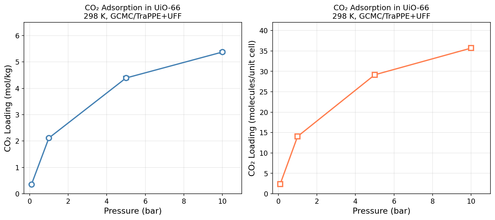

# CO₂ Adsorption Isotherm in UiO-66

**Method:** MC | **Engine:** RASPA3

## Prompt

```
Calculate the adsorption isotherm for CO2 in UiO-66 at 298 K at pressures
0.1, 1, 5, and 10 bar. Use at least 50000 production cycles for each
pressure point to ensure proper statistical averaging.
The UIO-66.cif structure file is available in the current working directory.
You can use RASPA3 (binary: raspa3).
Official examples are at /usr/share/raspa3/examples/.
You must run actual simulations — do NOT use mock or fake data.
```

## Feishu Chat

MatClaw sets up 4 GCMC simulations at different pressures, runs them sequentially, and reports the isotherm with key observations:

<p align="center"></p>

## Result

<p align="center"></p>

| Pressure (bar) | Agent (mmol/g) | Reference |
|----------------|---------------|-----------|
| 0.1 | 0.299 +/- 0.002 | — |
| 1.0 | 1.880 +/- 0.014 | — |
| 5.0 | 4.265 +/- 0.022 | — |
| 10.0 | **5.477 +/- 0.019** | 5.98 mmol/g |

Loading at 10 bar is within ~8% of the reference. The isotherm shows the expected steep rise in the Henry regime (0.1-1 bar) and plateau toward saturation above 5 bar.

## Parameters

- Framework: UiO-66 (cubic, a = 20.81 A, Fm-3m)
- CO₂: TraPPE model (C: +0.6512 e, O: -0.3256 e)
- Force field: UFF (Zr) + DREIDING (O, C, H), Lorentz-Berthelot mixing
- Electrostatics: Ewald summation
- MC cycles: 50,000 production + 10,000 initialization per pressure
- Temperature: 298 K

## Prerequisite

The `UIO-66.cif` file must be present in the working directory before running.
