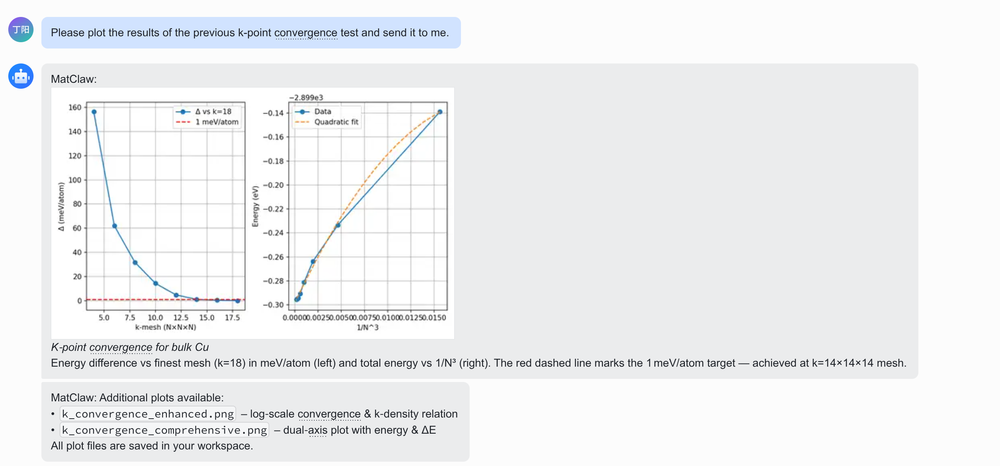
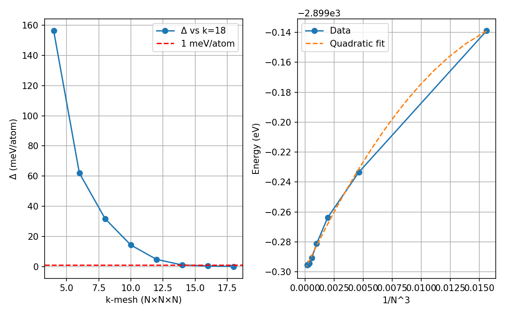

# Cu K-point Convergence

**Method:** DFT | **Engine:** Quantum ESPRESSO

## Prompt

```
Calculate the k-point density to converge bulk Cu energy to 1 meV/atom.
Pseudopotentials can be downloaded from
https://pseudopotentials.quantum-espresso.org/upf_files/
(e.g. Cu.pbe-dn-kjpaw_psl.1.0.0.UPF).
You must run actual QE calculations — do NOT use mock or fake data.
```

## Feishu Chat

User sends the prompt via Feishu. MatClaw autonomously downloads pseudopotentials, runs 8 QE calculations, and reports convergence data:

<p align="center"></p>

The agent then generates publication-quality convergence plots and sends them back:

<p align="center"></p>

## Result

<p align="center"></p>

| k-mesh | Total energy (Ry) | Delta E (meV/atom) |
|--------|-------------------|--------------------|
| 4x4x4 | -213.08028 | +162.7 |
| 6x6x6 | -213.08760 | +63.0 |
| 8x8x8 | -213.08979 | +33.3 |
| 10x10x10 | -213.09111 | +15.3 |
| 12x12x12 | -213.09192 | +4.3 |
| 14x14x14 | -213.09224 | -0.1 |
| 16x16x16 | -213.09223 | 0.0 (ref) |
| 18x18x18 | -213.09224 | -0.06 |

**Conclusion:** Energy converges to < 1 meV/atom at 14x14x14 k-mesh. A 12x12x12 mesh achieves ~4 meV/atom accuracy.

## Parameters

- Pseudopotential: `Cu.pbe-dn-kjpaw_psl.1.0.0.UPF` (PAW PBE)
- ecutwfc = 35 Ry, ecutrho = 280 Ry
- Smearing: Marzari-Vanderbilt, degauss = 0.01 Ry
- SCF convergence: 1e-8 Ry
