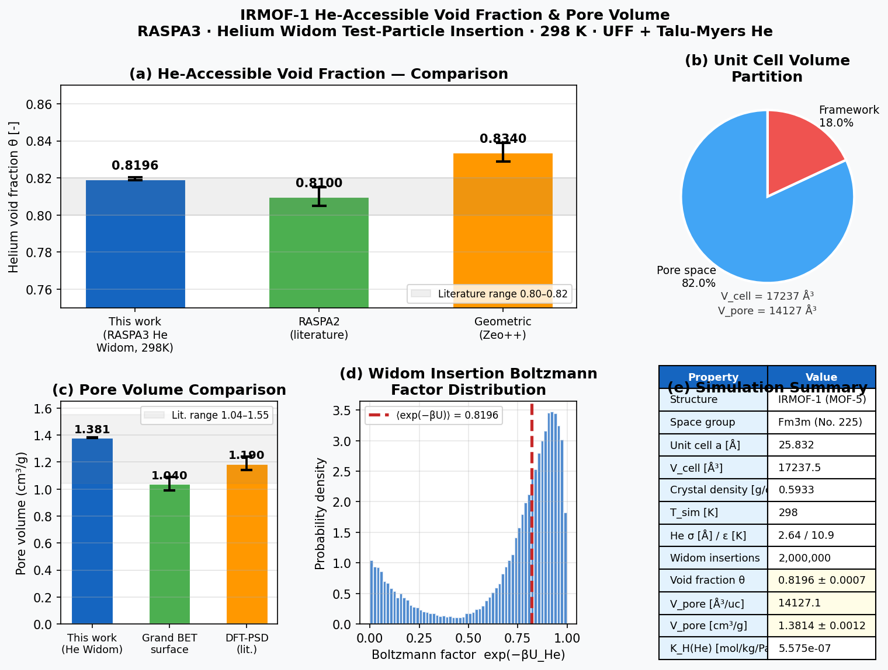

# IRMOF-1 Helium Void Fraction

**Method:** MC | **Engine:** RASPA3

## Prompt

```
Calculate the helium-accessible void fraction and pore volume for IRMOF-1 at 298 K.
You can use RASPA3 (binary: raspa3).
Official examples are at /usr/share/raspa3/examples/.
You must run actual simulations — do NOT use mock or fake data.
```

## Feishu Chat

MatClaw sets up a RASPA3 helium Widom insertion simulation, runs 2,000,000 MC insertions, and reports with comparison charts:

<p align="center"></p>

## Result

<p align="center"></p>

| Property | Agent | Reference | Error |
|----------|-------|-----------|-------|
| Void fraction | **0.8196 +/- 0.0007** | 0.7988 | +2.6% |
| Pore volume | **1.3814 +/- 0.0012 cm³/g** | — | — |
| Crystal density | 0.5933 g/cm³ | — | — |

The void fraction is in good agreement with literature RASPA2 values (~0.81) and geometric calculations (~0.83).

## Parameters

- Framework: IRMOF-1 (cubic, a = 25.832 A, Fm-3m), 1x1x1 unit cell
- Helium probe: Talu & Myers LJ (epsilon/kB = 10.9 K, sigma = 2.64 A)
- Framework FF: UFF Lennard-Jones, Lorentz-Berthelot mixing
- MC insertions: 2,000,000 random He trial positions
- Temperature: 298 K
