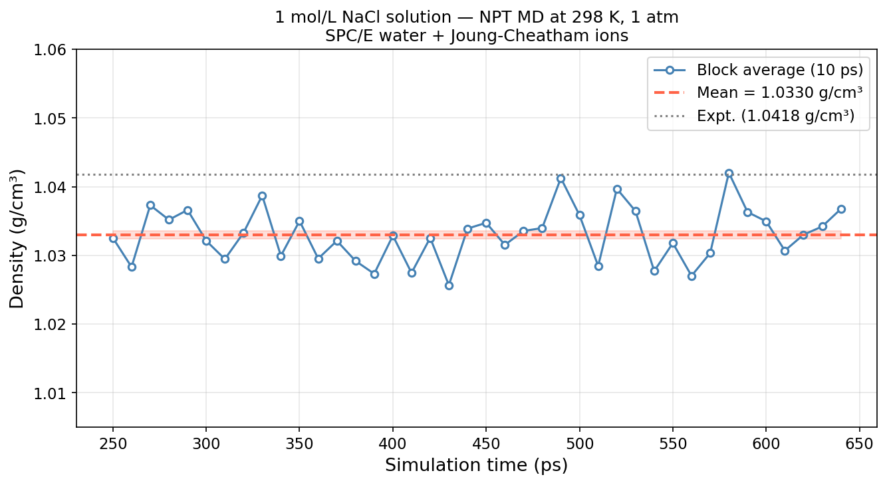

# NaCl Solution Density

**Method:** MD | **Engine:** LAMMPS + packmol

## Prompt

```
Calculate the density of a 1 mol/L NaCl aqueous solution at 298 K and 1 atm
using molecular dynamics. You will need to build the initial configuration
with packmol (not pre-installed — install it yourself via apt or conda).
Use LAMMPS (binary: lmp) with a suitable water model and ion parameters.
You must run actual simulations — do NOT use mock or fake data.
```

## Feishu Chat

MatClaw autonomously installs packmol (via conda, after discovering it's not pre-installed), builds the NaCl solution box, runs the simulation, and reports the density:

<p align="center"></p>

## Result

<p align="center"></p>

| Property | Agent | Reference | Error |
|----------|-------|-----------|-------|
| Density | **1.0330 +/- 0.0006 g/cm³** | 1.038 g/cm³ | -0.5% |

## Highlight: Autonomous Software Installation

This example demonstrates the agent's ability to **discover, install, and use software** not pre-installed in the container:

1. Tries `apt-get install packmol` — **permission denied** (non-root user)
2. Tries `conda install -c conda-forge packmol` — **environment not writable** (base conda is read-only)
3. Creates a new conda environment and installs packmol there — **success**

The agent understood the container's permission model and adapted its strategy without human intervention.

## Parameters

- Water model: SPC/E (rigid, SHAKE constraints)
- Ion parameters: Joung-Cheatham (JPCB 2008), optimized for SPC/E
- System: 1000 water + 18 Na⁺ + 18 Cl⁻ (c ≈ 1 mol/L)
- Initial config: packmol v21.2.1 (compiled from source by agent)
- Protocol: soft-core push-off -> NVT warm (10 ps) -> NPT equilibration (200 ps) -> NPT production (400 ps)
- Ensemble: NPT, 298 K, 1 atm, PPPM electrostatics
