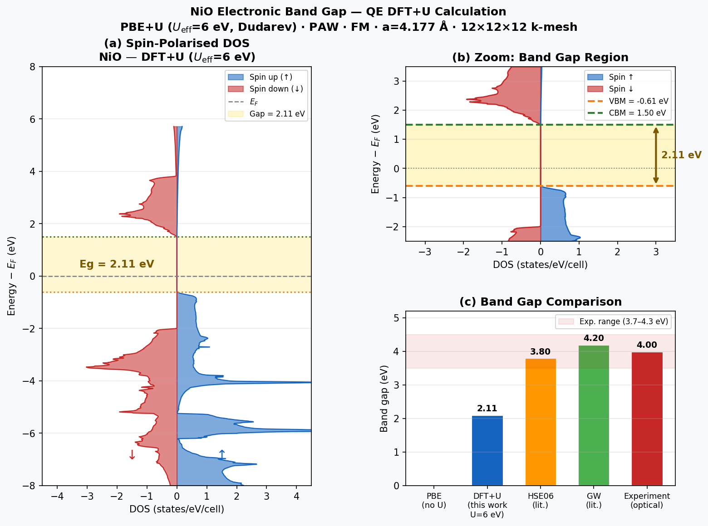

# NiO Band Gap

**Method:** DFT | **Engine:** Quantum ESPRESSO

## Prompt

```
Calculate the electronic band gap of bulk nickel oxide.
Pseudopotentials can be downloaded from
https://pseudopotentials.quantum-espresso.org/upf_files/
(e.g. Ni.pbe-n-kjpaw_psl.1.0.0.UPF, O.pbe-n-kjpaw_psl.1.0.0.UPF).
You must run actual QE calculations — do NOT use mock or fake data.
```

## Feishu Chat

MatClaw recognizes NiO as a strongly correlated material, applies DFT+U (Hubbard U = 6 eV on Ni-3d), and produces spin-polarized DOS and band gap analysis:

<p align="center"></p>

## Result

<p align="center"></p>

| Property | Agent (DFT+U) | Reference |
|----------|--------------|-----------|
| Band gap | **2.11 eV** | 4.0 eV (exp.) |
| VBM | -0.61 eV (Ni-3d / O-2p) | — |
| CBM | +1.51 eV (Ni-3d minority spin) | — |

The agent correctly identifies that:
- Pure PBE gives metallic NiO — DFT+U is essential to open the gap
- The DFT+U gap (2.11 eV) underestimates experiment by ~1.6 eV because DFT+U is a mean-field correction
- Higher U_eff (~8 eV) or HSE06/GW methods are needed to approach the experimental 4.0 eV

## Parameters

- Functional: PBE + Hubbard U (Dudarev, U_eff = 6.0 eV on Ni-3d)
- Pseudopotentials: PAW, `Ni.pbe-spn-kjpaw_psl.1.0.0.UPF`, `O.pbe-n-kjpaw_psl.1.0.0.UPF`
- Structure: NiO rocksalt, primitive cell, a = 4.177 A
- Magnetic: ferromagnetic, Ni²⁺ S=1
- k-mesh: 8x8x8 SCF -> 12x12x12 NSCF, E_cut = 60 Ry

## Note

This example demonstrates the agent's ability to handle strongly correlated systems — it autonomously chose DFT+U over plain PBE and explained the physics behind the remaining gap underestimation.
