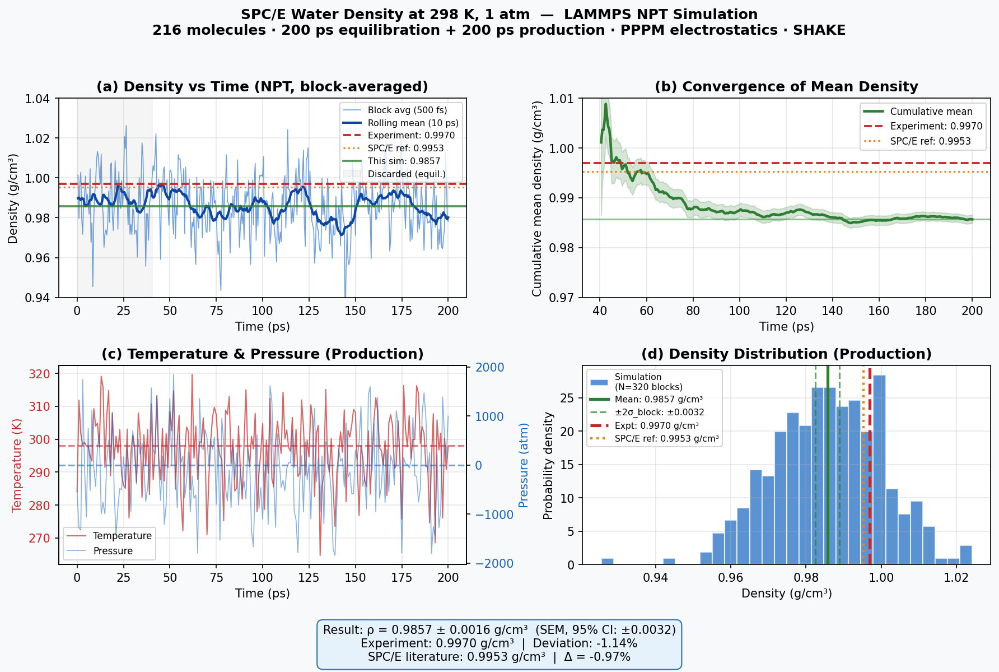

# Water Density

**Method:** MD | **Engine:** LAMMPS

## Prompt

```
Calculate the density of water at 298 K and 1 bar.
You may use LAMMPS with a suitable water model (e.g. SPC/E or TIP3P).
You must run actual simulations — do NOT use mock or fake data.
```

## Feishu Chat

MatClaw sets up an SPC/E water NPT simulation, runs equilibration and production, then reports with a 4-panel diagnostic plot:

<p align="center"></p>

## Result

<p align="center"></p>

| Property | Agent | Reference | Error |
|----------|-------|-----------|-------|
| Density | **0.9857 +/- 0.0016 g/cm³** | 0.997 g/cm³ | -1.1% |

The ~1% underestimate is consistent with known SPC/E finite-size effects (216 molecules) and the 9 A LJ cutoff.

## Parameters

- Water model: SPC/E (rigid, SHAKE-constrained)
- LJ cutoff: 9 A, PPPM accuracy: 1e-5
- System: 216 molecules, periodic cubic box
- Protocol: NVT 600->298 K (10 ps) -> NPT equilibration (100 ps) -> NPT production (200 ps)
- Timestep: 1 fs, total wall time: ~8 min
